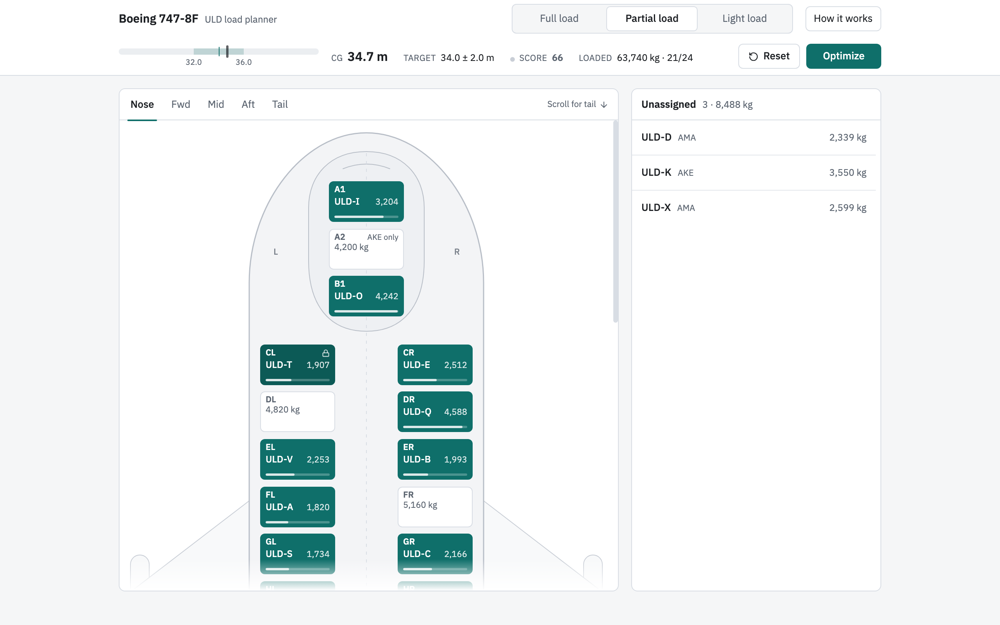
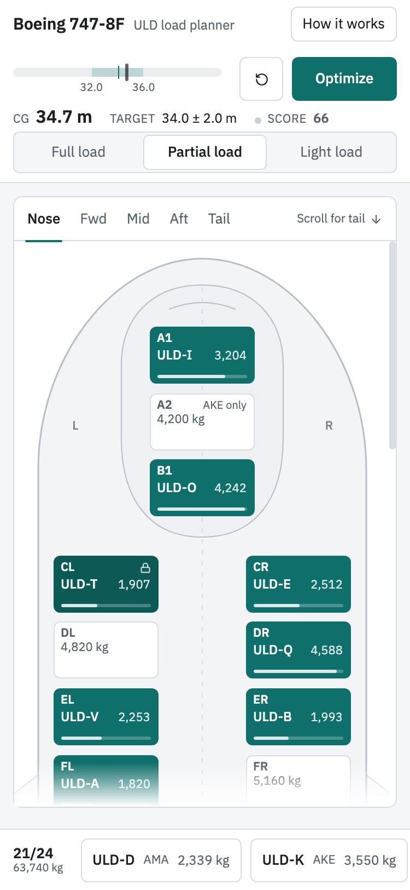

# Boeing 747-8F · ULD Load Planner

An interactive cargo load-planning demo. Drag ULD containers onto a top-down view of a 747-8F freighter, watch the centre of gravity move in real time, lock the positions you want to keep, and let a mixed-integer programme place the rest — solved by GLPK compiled to WebAssembly, entirely in your browser. No backend.

Rebuilt from a Cathay Cargo Hackathon 2025 finalist entry.

**Live demo:** https://cargo-demo.zijun.cloud

<p align="center">
  
</p>

## What it does

| | |
|---|---|
| **Aircraft view** | 34 cargo positions (nose A1/A2/B1, main deck rows C–Q left/right, tail R1) laid out on an accurate top-down 747-8F silhouette, nose at the top, scrolling like an airline seat map |
| **Load by hand** | Drag-and-drop on desktop, tap-to-place on mobile. Over-weight or wrong-type positions are dimmed and refused with a reason |
| **Lock positions** | Pin a ULD where it is; the optimiser treats it as fixed — human-in-the-loop planning |
| **Optimize** | A MILP assigns every remaining ULD to minimise longitudinal-CG deviation from the target plus a small lateral-imbalance penalty, respecting position weight limits and ULD-type rules |
| **Live CG strip** | Nose→tail gauge with the ±tolerance band, CG value, 0–100 score, loaded weight, solve time |
| **Three scenarios** | Full load (34 ULDs), Partial (24), Light (16) — same aircraft, different manifests, so you can see the solver choose *which* positions to leave empty |

<p align="center">
  
</p>

## How the optimiser works

Every ULD–position pair that fits (weight under the position limit, type allowed) becomes a binary variable `x[i,j]`. Each ULD must land in exactly one position, each position holds at most one ULD, and locked pairs are fixed at 1. Because total weight is a constant, the longitudinal CG is a linear function of those variables, so minimising its distance from the target is a mixed-integer linear programme:

```
minimise   |CG − target|  +  λ · |left–right moment| / W        (λ = 0.05)
subject to Σ_j x[i,j] = 1   for every ULD i
           Σ_i x[i,j] ≤ 1   for every position j
           W · CG = Σ w_i · a_j · x[i,j]
```

GLPK 5, compiled to WebAssembly via [glpk.js](https://github.com/jvail/glpk.js), solves it in a Web Worker. The full 34-ULD case is ≈ 1,100 binaries and solves to proven optimality in 40–360 ms on a laptop. Derivation, the original hackathon model (and its bug), and a comparison with the air-cargo load-planning literature: [`docs/algorithm.md`](docs/algorithm.md).

## Stack

Vite · React 19 · TypeScript · Tailwind CSS v4 · zustand · @dnd-kit/core · glpk.js · vitest

## Run locally

```bash
npm i
npm run dev        # http://localhost:5173
npm run test       # solver tests (vitest, runs GLPK in node)
npm run build      # static build → dist/
```

## Repository layout

```
src/domain/      types — Uld, Position, Flight, Assignment
src/data/        the three scenarios
src/solver/      MILP model builder, GLPK engine, result parser, tests
src/store/       zustand state (assignment, locks, selection, optimise)
src/components/  aircraft card, fuselage SVG, tiles, ULD panel, CG strip, drawer
docs/            algorithm.md · case-study.md · design specs and reviews
```

## Attribution

Built by Alex Bao. Originates from a Cathay Cargo Hackathon 2025 finalist project; the interactive rebuild (2026) replaced the server-side solver and 34-card list with an in-browser MILP and the aircraft view above. Positions, weights and ULD ids are synthetic hackathon values re-scaled to freighter magnitudes — not real airline data.

Case study: [`docs/case-study.md`](docs/case-study.md)

## License

MIT
